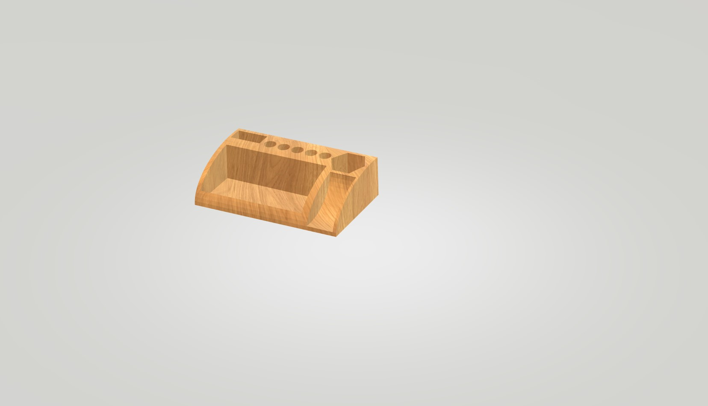

# half-life-warmup-project
HI, basically it's a simple 3D desk organizer modeled in tinker card to help hold random desk objects like pens and essential things according to my need.

                              PURPOSE
     I am submitting this design as a warmup project to test my GitHub workflow, file uploads and submission link before the main Half-Life event kicks off on the 5th. 

